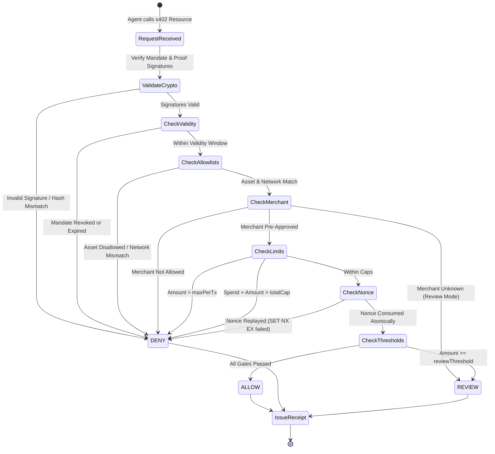

# CredaVer Network: Domain Model & State Transitions

## 1. Domain Entities & Schemas

### A. Mandate (Authority Envelope)
A signed cryptographic agreement between an Operator and an Agent.

| Field | Type | Description |
|---|---|---|
| `mandateId` | string (UUID) | Unique mandate identifier |
| `operatorPubkey` | string (Base58) | Solana public key of human operator / DAO |
| `agentPubkey` | string (Base58) | Solana/Ed25519 public key of autonomous agent |
| `allowedMerchants` | string[] | Array of approved merchant public keys, or `["*"]` for wildcard |
| `allowedAssets` | string[] | Array of approved token mints (e.g. devnet USDC, SOL) |
| `maxPerTx` | string (BigInt base units) | Maximum allowable amount per individual transaction |
| `totalCap` | string (BigInt base units) | Cumulative spend limit across the lifespan of the mandate |
| `reviewThreshold` | string? (BigInt base units) | Amount above which human operator review is required |
| `validFrom` | number (ms) | Start timestamp of mandate validity |
| `expiresAt` | number (ms) | Expiration timestamp of mandate |
| `nonce` | string | Anti-replay entropy for mandate issuance |
| `network` | string | Target blockchain network (`solana:devnet`) |
| `mandateHash` | string (SHA-256 Hex) | RFC 8785 canonical hash of core parameters |
| `operatorSignature` | string (Base58) | Ed25519 signature of `mandateHash` by Operator |
| `agentCounterSignature`| string (Base58) | Ed25519 counter-signature by Agent acknowledging terms |
| `revoked` | boolean | Server-side revocation flag (defaults to false) |

---

### B. Payment Proof (Request-Bound Evidence)
Constructed by the agent to prove intent to pay an exact x402 resource.

| Field | Type | Description |
|---|---|---|
| `mandateHash` | string (64-char Hex) | Bound mandate reference |
| `agentPubkey` | string (Base58) | Agent's public key |
| `merchantPubkey` | string (Base58) | Recipient merchant address |
| `asset` | string | Token mint address |
| `amount` | string (BigInt base units) | Exact requested transfer amount |
| `audience` | string (URI) | Exact URL/resource being accessed |
| `network` | string | `solana:devnet` |
| `nonce` | string | Unique single-use request nonce |
| `timestamp` | number (ms) | Proof creation time |
| `expiresAt` | number (ms) | Short validity window (e.g. 5 minutes) |
| `proofHash` | string (SHA-256 Hex) | Canonical hash of proof parameters |
| `signature` | string (Base58) | Ed25519 signature by Agent over `proofHash` |

---

### C. Verifiable Receipt (Performance & Performance Audit Trail)
Issued by the CredaVer Policy Decision Point after every evaluation.

| Field | Type | Description |
|---|---|---|
| `receiptId` | string (UUID) | Unique receipt identifier |
| `mandateHash` | string (64-char Hex) | Bound mandate reference |
| `agentPubkey` | string (Base58) | Agent public key |
| `merchantPubkey` | string (Base58) | Merchant public key |
| `asset` | string | Token mint address |
| `amount` | string (BigInt) | Transaction amount in base units |
| `network` | string | `solana:devnet` |
| `nonce` | string | Request nonce |
| `decision` | enum | `ALLOW` \| `DENY` \| `REVIEW` |
| `reasonCodes` | string[] | Array of machine-readable reason codes |
| `policyVersion` | string | Policy engine version (`credav-v1.0`) |
| `issuedAt` | number (ms) | Receipt issuance timestamp |
| `paymentTxSignature` | string? (Base58) | Solana devnet transaction signature |
| `reviewedBy` | string? (Base58) | Operator public key if human approved |
| `authorityPubkey` | string (Base58) | CredaVer authority public key |
| `receiptHash` | string (SHA-256 Hex) | RFC 8785 canonical hash of receipt body |
| `authoritySignature` | string (Base58) | CredaVer Ed25519 signature over `receiptHash` |

---

## 2. Policy Decision State Machine

